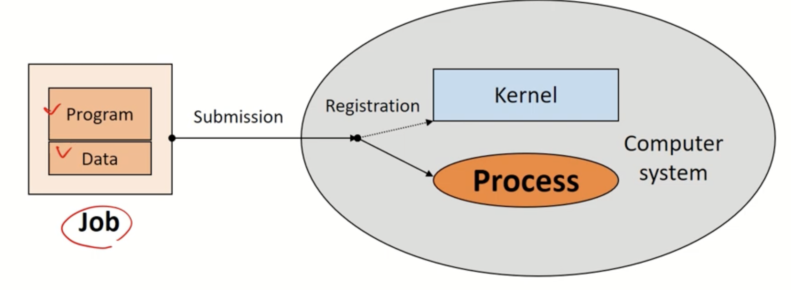
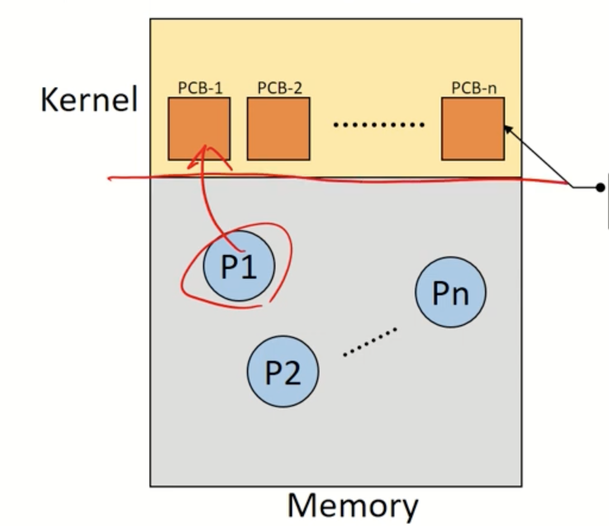
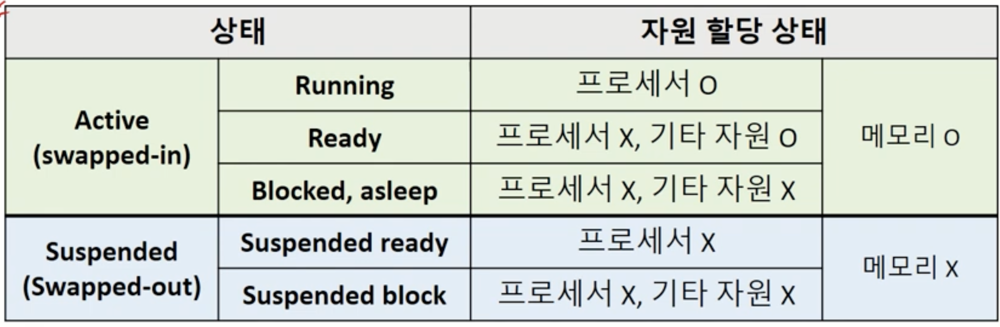
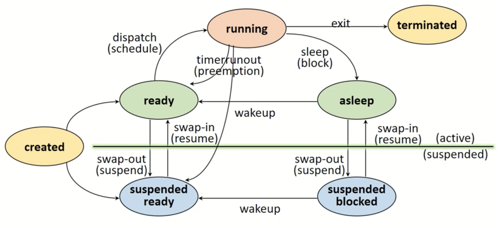
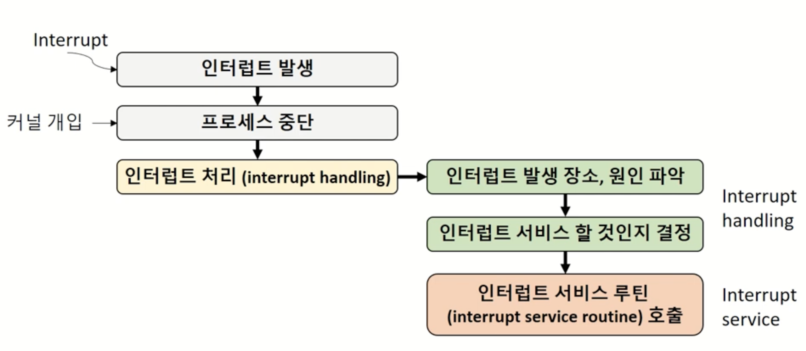
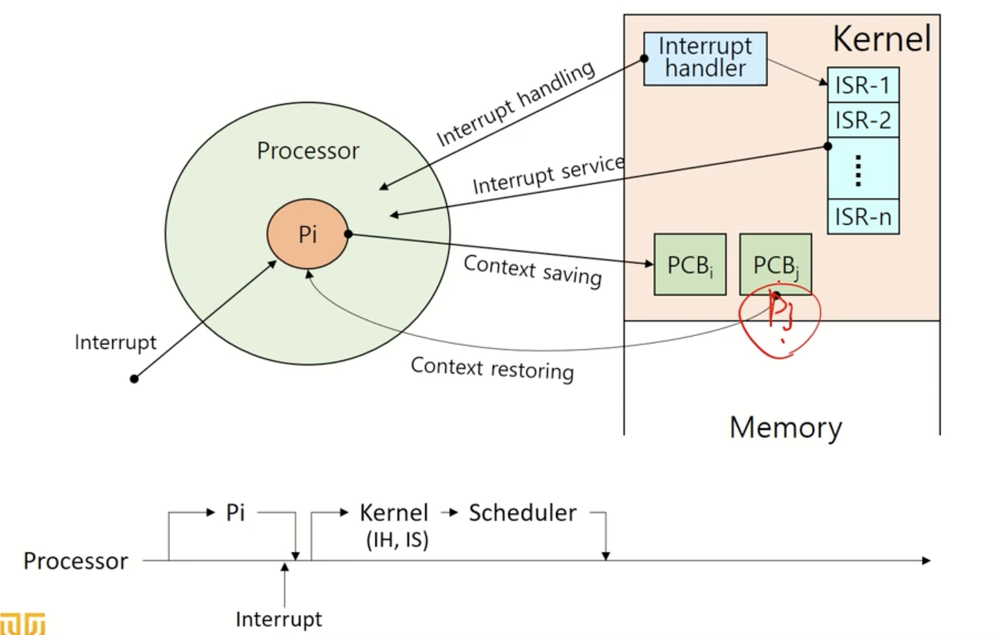

# 프로세스 관리

## 프로세스(Process)

### 작업(Job) vs 프로세스(Process)

- **작업(Job) / 프로그램(Program)**  
  - 실행할 프로그램과 데이터가 디스크에 존재하는 상태
  - 아직 실행되지 않은 상태로, 시스템에 실행 요청을 보내기 전

- **프로세스(Process)**  
  - 실행을 위해 시스템(커널)에 등록되고, 메모리를 할당받은 상태
  - 운영체제(OS)의 커널에 의해 관리됨
  - 각종 자원을 요청하고 사용할 수 있는 능동적인 개체

### 프로세스의 정의

- 프로세스는 실행 중인 프로그램을 의미함
- 운영체제(OS)의 커널에 등록되어 커널에 의해 관리되는 작업
- 자원을 요청하고 할당받을 수 있는 독립적인 개체
- 프로세스 관리 블록(Process Control Block, PCB)을 통해 관리됨
- 프로세스는 능동적(Active entity) 개체임

### 자원(Resource)의 개념

- 자원은 커널에 의해 관리되는 수동적인 개체(passive entity)이며, 프로세스에게 할당 및 반납됨

#### 자원의 분류

- 하드웨어 자원 (HW Resource)
  - CPU(Processor), 메모리(Memory), 디스크(Disk) 등

- 소프트웨어 자원 (SW Resource)
  - 메시지(Message), 신호(Signal), 파일(File) 등

### 프로세스 제어 블록(Process Control Block, PCB)

- 운영체제가 프로세스 관리에 필요한 정보를 저장하는 자료구조
- 프로세스 생성 시 PCB도 생성되어 관리됨

#### PCB가 관리하는 정보들

- PID(Process ID): 프로세스를 식별하는 고유 번호
- 스케줄링 정보: 우선순위 등 프로세스 스케줄링과 관련된 정보
- 프로세스 상태: 현재 상태 및 자원 할당 요청 등의 정보
- 메모리 관리 정보: 페이지 테이블(Page table), 세그먼트 테이블(Segment table) 등
- 입출력(I/O) 상태 정보: 할당받은 입출력 장치 및 파일 관련 정보
- 문맥 저장 영역: 레지스터의 상태 등 프로세스의 실행 컨텍스트 정보
- 계정 정보: 자원 사용 시간 및 사용량 정보 등

## 프로세스의 상태(Process States)

자원간의 상호 작용에 의해 결정됨

### 프로세스 상태 전이(State Transition)
- **생성(Created) 상태**
  - 프로세스가 커널에 처음 등록되는 상태
  - PCB가 할당되며, 가용 메모리 공간에 따라 Ready 또는 Suspended Ready로 전이됨

- **준비(Ready) 상태**
  - 프로세서(CPU)를 제외한 모든 자원을 할당받은 상태
  - 프로세서 할당 대기 중으로 즉시 실행 가능함
  - 디스패치(Dispatch/Schedule)를 통해 Running 상태로 전환됨

- **실행(Running) 상태**
  - 프로세서를 할당받아 실제로 실행 중인 상태
  - 선점(Preemption)에 의해 Ready 상태로 돌아갈 수 있음 (타임아웃, 우선순위 변경 등)
  - I/O 자원 요청(Block/Sleep)이 발생하면 Blocked 상태로 전환됨

- **대기(Blocked/Asleep) 상태**
  - 프로세서 외의 자원을 기다리는 상태 (예: 입출력 장치)
  - 자원 할당 요청은 시스템 호출(System call)을 통해 이루어짐
  - 대기 중인 자원을 할당받으면 다시 Ready 상태로 전환됨 (Wake-up)

- **일시 중단(Suspended) 상태**
  - 메모리를 빼앗기거나 할당받지 못해 프로세스의 메모리 이미지를 Swap 장치로 이동한 상태
  - 스왑 장치(Swap Device)는 메모리 부족 시 프로세스의 정보를 임시로 저장하는 파일 시스템
  - Swap-out(Suspended): 메모리에서 스왑 장치로 이동
  - Swap-in(Resume): 메모리가 확보되면 다시 메모리로 복귀하여 Ready 상태로 전환됨

- **종료(Terminated/Zombie) 상태**
  - 프로세스 실행이 완료된 상태
  - 자원을 모두 반납하고 일부 PCB 정보만 커널에 남아 있는 상태
  - 이후 프로세스 관리를 위한 정보 수집에 사용됨

## 인터럽트(Interrupt)

- 외부에서 발생하는 예기치 못한 이벤트 (Unexpected, External Events)
- 시스템이 현재 작업을 멈추고 우선적으로 처리해야 하는 상황

### 인터럽트 종류

- I/O Interrupt (입출력 인터럽트)
- Clock Interrupt (시계 인터럽트)
- Console Interrupt (콘솔 인터럽트)
- Program Interrupt (프로그램 예외 인터럽트)
- Machine Check Interrupt (기계 점검 인터럽트)
- Inter-process Interrupt (프로세스 간 인터럽트)
- System Call Interrupt (시스템 호출 인터럽트)

### 인터럽트 처리 과정

1. 프로세스 실행 중 인터럽트 발생
2. 커널이 개입하여 현재 프로세스를 일시 중단하고 Context Saving 수행
3. 인터럽트 처리(Interrupt Handling) 진행
4. 인터럽트 서비스(Interrupt Service)를 수행한 후, 프로세서가 비게 되면 Ready 상태의 다른 프로세스를 실행함 (기존 프로세스가 아닐 수도 있음)

## 문맥 교환(Context Switching)

- 문맥(Context): 프로세스와 관련된 상태 정보의 집합
  - CPU 레지스터(Context)는 CPU에 존재
  - 코드, 데이터, 스택, PCB 등은 메모리에 존재

## Context?
프로세스와 관련된 정보들의 집합

  - cpu register context => in cpu
  - code & data, stack, pcb => in memory
  
### 문맥 교환의 과정

- Context Saving: 현제 프로세스의 Register context 를 저장하는 작업
  - memory 에 PCB 에 저장
- Context restoring: Register context 를 프로세스로 복구하는 작업
- Context switching: 실행 중인 프로세스의 context 를 저장하고, 앞으로 실행 할 프로세스의 context 를 복구 하는 일
  - Context saving + Context restoring 작업을 함께하는 것, 즉 프로세스의 컨텍스트가 바뀌는 것
  - 커널의 개입으로 이루어짐

### 문맥 교환의 오버헤드(Overhead)

- 문맥 교환은 운영체제마다 차이가 있지만 필연적으로 비용(시간 및 자원 소모)이 발생함
- 잦은 문맥 교환은 시스템 성능을 저하시킬 수 있으므로, 효율적인 프로세스 관리로 불필요한 문맥 교환을 최소화하는 것이 중요함
- 대표적으로 문맥 교환 오버헤드를 줄이기 위해 쓰레드(Thread)를 사용함
